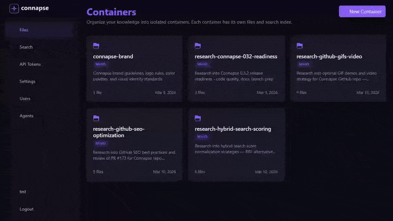
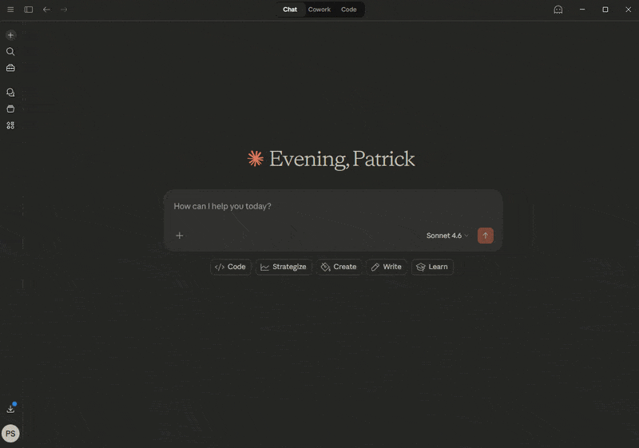
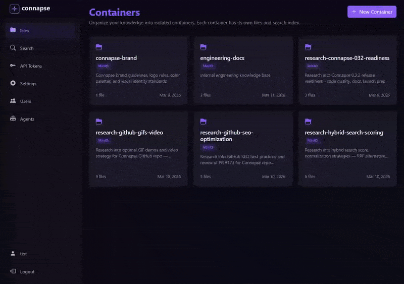

<p align="center">
  
</p>

<p align="center">
  <em>The knowledge backend for AI agents. Open-source, container-isolated, hybrid search.</em>
</p>

<p align="center">
  <a href="LICENSE"></a>
  <a href="https://dotnet.microsoft.com/"></a>
  <a href="https://github.com/Destrayon/Connapse/actions"></a>
  <a href="https://github.com/Destrayon/Connapse/actions"></a>
  <a href="CONTRIBUTING.md"></a>
  <a href="https://github.com/Destrayon/Connapse/issues"></a>
  <a href="https://github.com/Destrayon/Connapse/stargazers"></a>
  <a href="https://github.com/Destrayon/Connapse#-quick-start"></a>
</p>

<p align="center">
  
</p>

> *Upload documents and search your knowledge base with hybrid AI search — in seconds.*

Connapse is an open-source platform that turns your documents into searchable, AI-ready knowledge — organized in isolated containers, each with its own vector index and search configuration. Point it at your existing S3 buckets, Azure Blob containers, or local filesystems. Connect it to Claude via MCP — agents can both query your knowledge base and build their own research corpus by uploading and organizing documents. Use the REST API, web UI, or CLI. Built on .NET 10 — not another Python monolith.

<details>
<summary><strong>🤖 AI Agent Integration</strong> — Claude queries and builds your knowledge base via MCP</summary>
<br>

<p align="center">
  
</p>

> *AI agents query your knowledge base through the MCP server, receiving structured answers with source citations from your documents.*

</details>

<details>
<summary><strong>🎛️ Your Knowledge, Your Rules</strong> — Runtime configuration without restarting</summary>
<br>

<p align="center">
  
</p>

> *Switch embedding providers, tune chunking parameters, and configure search — all at runtime, without restarting.*

</details>

---

## 📦 Quick Start

```bash
git clone https://github.com/Destrayon/Connapse.git && cd Connapse && docker-compose up -d
# Open http://localhost:5001
```

### Prerequisites

- [Docker](https://docs.docker.com/get-docker/) & [Docker Compose](https://docs.docker.com/compose/install/)
- [.NET 10 SDK](https://dotnet.microsoft.com/download) (for development)
- (Optional) [Ollama](https://ollama.ai/) for local embeddings

### Run with Docker Compose

```bash
# Clone the repository
git clone https://github.com/Destrayon/Connapse.git
cd Connapse

# Set required auth environment variables (or use a .env file)
export CONNAPSE_ADMIN_EMAIL=admin@example.com
export CONNAPSE_ADMIN_PASSWORD=YourSecurePassword123!
export Identity__Jwt__Secret=$(openssl rand -base64 64)

# Start all services (PostgreSQL, MinIO, Web App)
docker-compose up -d

# Open http://localhost:5001 — log in with the admin credentials above
```

The first run will:
1. Pull Docker images (~2-5 minutes)
2. Initialize PostgreSQL with pgvector extension and run EF Core migrations
3. Create MinIO buckets
4. Seed the admin account (from env vars) and start the web application

### Development Setup

```bash
# Start infrastructure only (database + object storage)
docker-compose up -d postgres minio

# Run the web app locally
dotnet run --project src/Connapse.Web

# Run all tests
dotnet test

# Run just unit tests
dotnet test --filter "Category=Unit"
```

### Using the CLI

Install the CLI (choose one option):

```bash
# Option A: .NET Global Tool (requires .NET 10)
dotnet tool install -g Connapse.CLI

# Option B: Download native binary from GitHub Releases (no .NET required)
# https://github.com/Destrayon/Connapse/releases
```

Basic usage:

```bash
# Authenticate first
connapse auth login --url https://localhost:5001

# Create a container (project)
connapse container create my-project --description "My knowledge base"

# Upload files
connapse upload ./documents --container my-project

# Search
connapse search "your query" --container my-project

# Update to latest release (--pre to include alpha/pre-release builds)
connapse update
connapse update --pre
```

### Using with Claude (MCP)

Connapse includes a Model Context Protocol (MCP) server for integration with Claude and any MCP client.

**Setup**:
1. Create an Agent in the Connapse UI (`/admin/agents`) and generate an API key
2. Configure Claude to send requests to your Connapse instance with the agent's `X-Api-Key`

The MCP server exposes **11 tools**:

| Tool | Description |
|------|-------------|
| `container_create` | Create a new container for organizing files |
| `container_list` | List all containers with document counts |
| `container_delete` | Delete a container |
| `container_stats` | Get container statistics (documents, chunks, storage, embeddings) |
| `upload_file` | Upload a single file to a container |
| `bulk_upload` | Upload up to 100 files in one operation |
| `list_files` | List files and folders at a path |
| `get_document` | Retrieve full parsed text content of a document |
| `delete_file` | Delete a single file from a container |
| `bulk_delete` | Delete up to 100 files in one operation |
| `search_knowledge` | Semantic, keyword, or hybrid search within a container |

> **Write guards**: S3 and AzureBlob containers are read-only (synced from source). Filesystem containers respect per-container permission flags. Upload and delete tools will return an error for containers that block writes.

---

## 🚀 Features

- **🗂️ Container-Isolated Knowledge** — Each project gets its own vector index, storage connector, and search configuration. No cross-contamination between projects, teams, or clients.
- **🔍 Hybrid Search** — Vector similarity + keyword full-text with configurable fusion (convex combination, DBSF, AutoCut). Get results that pure vector search misses.
- **🧠 Multi-Provider AI** — Swap between Ollama, OpenAI, Azure OpenAI, and Anthropic for both embeddings and LLM — at runtime, per container, without restarting.
- **🔌 Index Your Existing Storage** — Connect MinIO, local filesystem (live file watching), S3 (IAM auth), or Azure Blob (managed identity). Your files stay where they are.
- **🤖 4 Access Surfaces** — Web UI, REST API, CLI (native binaries), and MCP server (11 tools for Claude). Built for humans, scripts, and AI agents equally.
- **🔐 Enterprise Auth** — Three-tier RBAC (Cookie + PAT + JWT) with AWS IAM Identity Center and Azure AD identity linking. Cloud permissions are the source of truth.
- **🐳 One-Command Deploy** — Docker Compose with PostgreSQL + pgvector, MinIO, and optional Ollama. Structured audit logging and rate limiting built in.

<details>
<summary><strong>See all features</strong></summary>

- **📄 Multi-Format Ingestion**: PDF, Office documents, Markdown, plain text — parsed, chunked, and embedded automatically
- **⚡ Real-Time Processing**: Background ingestion with live progress updates via SignalR
- **🎛️ Runtime Configuration**: Change chunking strategy, embedding model, and search settings per container without restart
- **☁️ Cloud Identity Linking**: AWS IAM Identity Center (device auth flow) + Azure AD (OAuth2+PKCE) with IAM-derived scope enforcement
- **👥 Invite-Only Access**: Admin-controlled user registration with four roles (Admin / Editor / Viewer / Agent)
- **🤖 Agent Management**: Dedicated agent entities with API key lifecycle, scoped permissions, and audit trails
- **📋 Audit Logging**: Structured audit trail for uploads, deletes, container operations, and auth events
- **📦 CLI Distribution**: Native self-contained binaries (Windows/Linux/macOS) and .NET global tool via NuGet
- **🔄 Cross-Model Search**: Switch embedding models mid-project — automatic Semantic→Hybrid fallback for legacy vectors

</details>

---

## 🎯 Who Is Connapse For?

- **AI agent developers** who need a knowledge backend their agents can both query and build — upload research, curate a corpus, and search it via MCP or REST API
- **.NET / Azure teams** who want a RAG platform that fits their existing stack and cloud identity
- **Enterprise teams** who need project-isolated knowledge bases with proper RBAC and audit trails
- **Anyone tired of re-uploading files** — point Connapse at your existing S3/Azure/filesystem storage

<details>
<summary><strong>⚠️ Security Status (v0.3.x)</strong></summary>

**This project is in active development (v0.3.2) and approaching production-readiness.**

v0.3.x adds cloud connector architecture with IAM-based access control, multi-provider embeddings and LLM support, cloud identity linking (AWS SSO + Azure AD), and rate limiting.

- ✅ **Authentication and authorization** (v0.2.0)
- ✅ **Role-based access control** (Admin / Editor / Viewer / Agent)
- ✅ **Audit logging**
- ✅ **Cloud identity linking** — AWS IAM Identity Center + Azure AD OAuth2+PKCE (v0.3.0)
- ✅ **IAM-derived scope enforcement** — cloud permissions are source of truth (v0.3.0)
- ✅ **Rate limiting** — built-in ASP.NET Core middleware with per-user and per-IP policies (v0.3.2)
- ⚠️ **Set a strong `Identity__Jwt__Secret`** in production — see [deployment guide](docs/deployment.md)

See [SECURITY.md](SECURITY.md) for the full security policy.

</details>

---

## 🏗️ Architecture

```
┌─────────────────────────────────────────────────────────────┐
│                     Access Surfaces                         │
│  Web UI (Blazor)  │  REST API  │  CLI  │  MCP Server       │
└────────────┬────────────────────────────────────────────────┘
             │
┌────────────▼────────────────────────────────────────────────┐
│                   Core Services Layer                        │
│  Document Store  │  Vector Store  │  Search  │  Ingestion  │
└────────────┬────────────────────────────────────────────────┘
             │
┌────────────▼────────────────────────────────────────────────┐
│                    Connectors Layer                           │
│  MinIO  │  Filesystem  │  S3  │  Azure Blob               │
└────────────┬────────────────────────────────────────────────┘
             │
┌────────────▼────────────────────────────────────────────────┐
│                    Infrastructure                            │
│  PostgreSQL+pgvector  │  MinIO (S3)  │  Ollama (optional)  │
└─────────────────────────────────────────────────────────────┘
```

### Data Flow: Upload → Search

```
[Upload] → [Parse] → [Chunk] → [Embed] → [Store] → [Searchable]
              ↓
         [Metadata]
              ↓
        [Document Store]
```

**Target**: < 30 seconds from upload to searchable.

**Key Technologies**:
- **Database**: PostgreSQL 17 + pgvector for vector embeddings
- **Object Storage**: MinIO (S3-compatible) for original files
- **Backend**: ASP.NET Core 10 Minimal APIs
- **Frontend**: Blazor Server (interactive mode)
- **Embeddings**: Ollama (default), OpenAI, Azure OpenAI (configurable)
- **LLM**: Ollama, OpenAI, Azure OpenAI, Anthropic (configurable)
- **Search**: Hybrid vector + keyword with convex combination fusion
- **Connectors**: MinIO, Filesystem, S3, Azure Blob

---

## 📚 Documentation

- [Architecture Guide](docs/architecture.md) - System design and component overview
- [API Reference](docs/api.md) - REST API endpoints and examples
- [Connectors Guide](docs/connectors.md) - Connector types, configuration, and background sync
- [AWS SSO Setup](docs/aws-sso-setup.md) - AWS IAM Identity Center integration
- [Azure Identity Setup](docs/azure-identity-setup.md) - Azure AD OAuth2+PKCE integration
- [Deployment Guide](docs/deployment.md) - Docker and production setup
- [Security Policy](SECURITY.md) - Security limitations and roadmap
- [Contributing Guidelines](CONTRIBUTING.md) - How to contribute

---

## 🗺️ Roadmap

Connapse is pre-1.0. Major design work is tracked in [Discussions](https://github.com/Destrayon/Connapse/discussions).

### v0.1.0 — Foundation (Complete)
- ✅ Document ingestion pipeline (PDF, Office, Markdown, text)
- ✅ Hybrid search (vector + keyword with convex combination fusion)
- ✅ Container-based file browser with folders
- ✅ Web UI, REST API, CLI, MCP server

### v0.2.0 — Security & Auth (Complete)
- ✅ Three-tier auth: Cookie + Personal Access Tokens + JWT (HS256)
- ✅ Role-based access control (Admin / Editor / Viewer / Agent)
- ✅ Invite-only user registration (admin-controlled)
- ✅ First-class agent entities with API key lifecycle
- ✅ Agent management UI + PAT management UI
- ✅ Audit logging (uploads, deletes, container operations)
- ✅ CLI auth commands (`auth login`, `auth whoami`, `auth pat`)
- ✅ GitHub Actions release pipeline (native binaries + NuGet tool)
- ✅ 256 passing tests (unit + integration)

### v0.3.0 — Connector Architecture (Complete)
- ✅ 4 connector types: MinIO, Filesystem (FileSystemWatcher), S3 (IAM-only), Azure Blob (managed identity)
- ✅ Per-container settings overrides (chunking, embedding, search, upload)
- ✅ Cloud identity linking: AWS IAM Identity Center (device auth flow) + Azure AD (OAuth2+PKCE)
- ✅ IAM-derived scope enforcement — cloud permissions are the source of truth
- ✅ Multi-provider embeddings: Ollama, OpenAI, Azure OpenAI
- ✅ Multi-provider LLM: Ollama, OpenAI, Azure OpenAI, Anthropic
- ✅ Multi-dimension vector support with partial IVFFlat indexes per model
- ✅ Cross-model search: automatic Semantic→Hybrid fallback for legacy vectors
- ✅ Background sync: FileSystemWatcher for local, 5-min polling for cloud containers
- ✅ Connection testing for all providers (S3, Azure Blob, MinIO, LLM, embeddings, AWS SSO, Azure AD)
- ✅ 457 passing tests (unit + integration)

### Future
- **v0.4.0**: Communication connectors (Slack, Discord)
- **v0.5.0**: Knowledge platform connectors (Notion, Confluence, GitHub)
- **v1.0.0**: Production-ready stable release

---

## 🤝 Contributing

We welcome contributions! Please see [CONTRIBUTING.md](CONTRIBUTING.md) for guidelines.

**Quick contribution checklist**:
- Fork the repo and create a feature branch
- Follow code conventions in [CONTRIBUTING.md](CONTRIBUTING.md)
- Write tests for new features (xUnit + FluentAssertions)
- Ensure all tests pass: `dotnet test`
- Update documentation if needed
- Submit a pull request

**Good first issues**: Check [issues labeled `good-first-issue`](https://github.com/Destrayon/Connapse/labels/good-first-issue)

---

## 📄 License

This project is licensed under the **MIT License** - see [LICENSE](LICENSE) for details.

You are free to:
- ✅ Use commercially
- ✅ Modify
- ✅ Distribute
- ✅ Sublicense
- ✅ Use privately

The only requirement is to include the copyright notice and license in any substantial portions of the software.

---

## 💬 Support & Community

- 📖 **Documentation**: [docs/](docs/)
- 🐛 **Bug Reports**: [GitHub Issues](https://github.com/Destrayon/Connapse/issues)
- 💡 **Feature Requests**: [GitHub Discussions](https://github.com/Destrayon/Connapse/discussions)
- 🔒 **Security Issues**: See [SECURITY.md](SECURITY.md)

---

## 🙏 Acknowledgments

Built with:
- [.NET](https://dotnet.microsoft.com/) - Application framework
- [Blazor](https://dotnet.microsoft.com/apps/aspnet/web-apps/blazor) - Web UI
- [PostgreSQL](https://www.postgresql.org/) + [pgvector](https://github.com/pgvector/pgvector) - Vector database
- [MinIO](https://min.io/) - S3-compatible object storage
- [Ollama](https://ollama.ai/) - Local LLM inference

---

**⭐ If you find this project useful, please star the repository to show your support!**
